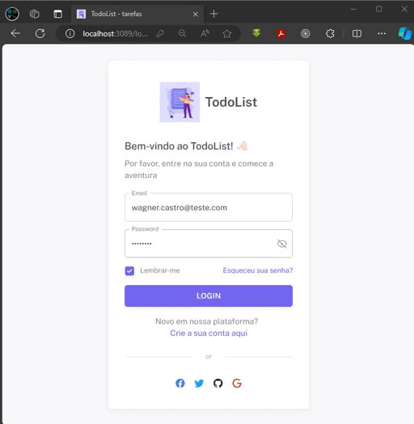
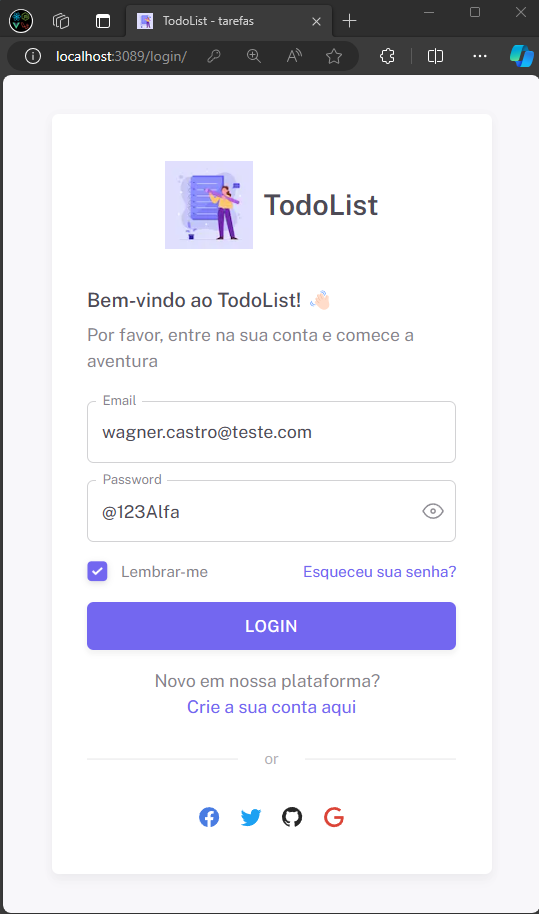
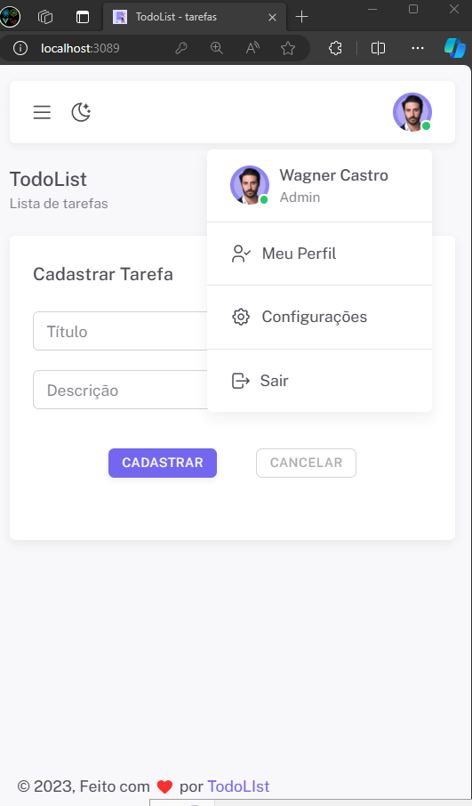
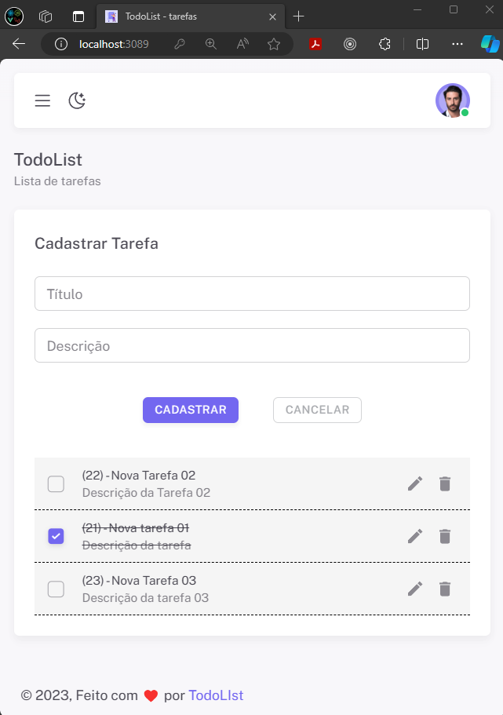

# Desafio Node.js e React.js

### Versões de dependências utilizadas

- Node 18.17.0
- Npm 9.6.7
- Nest 9.0.0

### Baixe e execute o projeto localmente

**1 -** Atenção!! Para iniciar este projeto sem erro precisa primeiro iniciar a API do Backend

**2 -** Clone o projeto e instale as dependências:

```
$ git https://github.com/wagnerGCastro/desafio-nobuzz-nodejs-reactjs
$ cd desafio-nobuzz-nodejs-reactjs
```

**2 -** Executar os camandos docker para subir o Frontend Localmente,

```
1- $ docker-compose -f docker-compose.dev.yml --compatibility build --no-cache frontend

2- $ docker-compose -f docker-compose.dev.yml --compatibility up --remove-orphans frontend
```

**3 -** Para logar no sistema precisa primeiro cadastrar um usuário na API:

```
- Usuário Admin
  email: wagner.castro@teste.com
  password: @123Alfa
```

**4 -** Depois do banco Postgres ter subido sem erro no backend, agora pode acessar o frontend:

Abra o navegador e acesse [http://localhost:3089](http://localhost:3089) para visualizar o projeto.

**5 -** O arquivo api.example.http dentro da pasta backend contém os endpoints da API de exemplo
para executar o aquivo precisar instalar o plugin REST Client do Vscode

```
$ ./desafio-nobuzz-nodejs-reactjs/backend/api.example.http
```

**6 -** Preview do projeto finalizado:)



###



###



###


```
